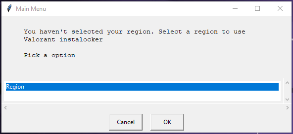
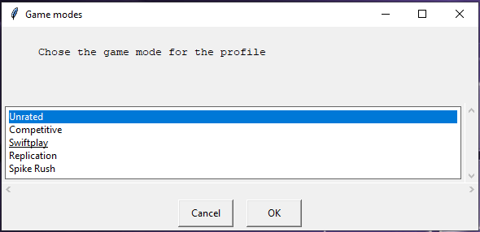
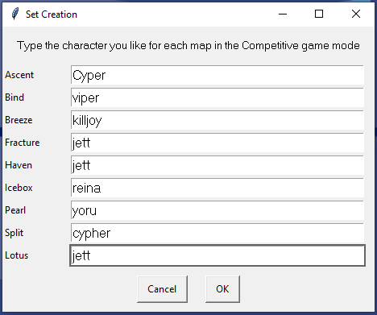
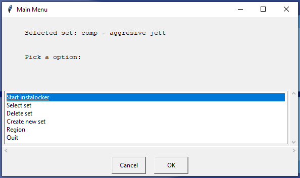
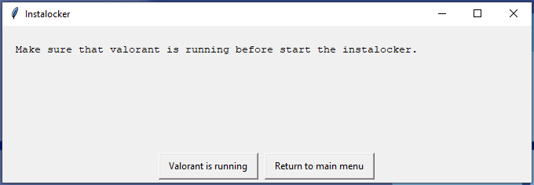

# VALORANT Agent Yoinker
A VALORANT tool for instalocking agents.

# Getting Started
These instructions will give you a copy of the project up and running on your local machine

## For users
- Download the [latest release](https://github.com/deadly/valorant-agent-yoinker/releases).
- Extract the zip file if needed.

Now you have the executable file of the program. Double-click on it to start.

## For developers
- Download the source code from the [releases](https://github.com/deadly/valorant-agent-yoinker/releases) or from the green button on the top of the [project page](https://github.com/deadly/valorant-agent-yoinker). You can also fork the project to your profile.
- Install python3 from the [official site](https://www.python.org/).
- Install the dependencies from the requirements.txt file.

Now you have the project to use. Don't forget to read the license.

# How to Use
The program is very intuitive and all information will appear on the screen.
Here is a simple walkthrough.

## Region
When you open the program for the first time you'll need to enter your server region. [Here](https://support-valorant.riotgames.com/hc/en-us/articles/360055678634-Server-Select) is a list of server locations and their respective regions. You can change it anytime you want.

## Profile
After you enter your region, new options will appear on the screen.
These options allow you to create a profile, which is your preference for an agent in each map in a specific game mode. 

This allows you to create predefined combinations of agents-map-gamemodes to use during your playtime.

You can create, delete or select a profile from the main menu options

## Starting
After selecting the profile you want, the option to start the instalocker will appear. You will be prompted to start the Valorant before continuing with the instalocker. When your Valorant is opened, confirm the program and you can start looking for a match.

When the character selection starts your agent will already be selected.

# [Discord Support Server](https://discord.gg/faeM7p92pz)
Enter [our discord server](https://discord.gg/faeM7p92pz) to chat and get support from me and other users!

# How it Works
Agent selecting is handled via the VALORANT Official API, which means that this program does not mess with the game's memory or files at all.

# Is This "bannable"?
**USE AT YOUR OWN RISK.**

**No suspensions have been reported so far from using this program.**

This program **does not** use an auto-clicker, read the game's memory or files; therefore, the anti-cheat **should not** be triggered.

However, using the VALORANT API in this manner is against Riot's Terms of Service, since you are getting an advantage over other players. So there is always a risk.

# Contributing
By contributing, you can help improve the project and make it better for everyone. Please read this guide to understand how to contribute to the project.

## By [Discord Server](https://discord.gg/faeM7p92pz)
• You can request features and report bugs you encounter while using the instalocker.

See our [Discord Server](https://discord.gg/faeM7p92pz) for more details

## By Submitting a Pull Request

1. Fork the repository and create your branch from `main`.

2. Make the code changes

3. Commit your changes with a clear and concise commit message including the reasoning behind them.

4. Push your branch to your forked repository.

5. Submit a pull request to the main repository.

6. Wait for the project maintainer's feedback.

### Style Guide

- Follow the PEP8 style and conventions.
- Add comments to your code and doc-strings to your functions.

